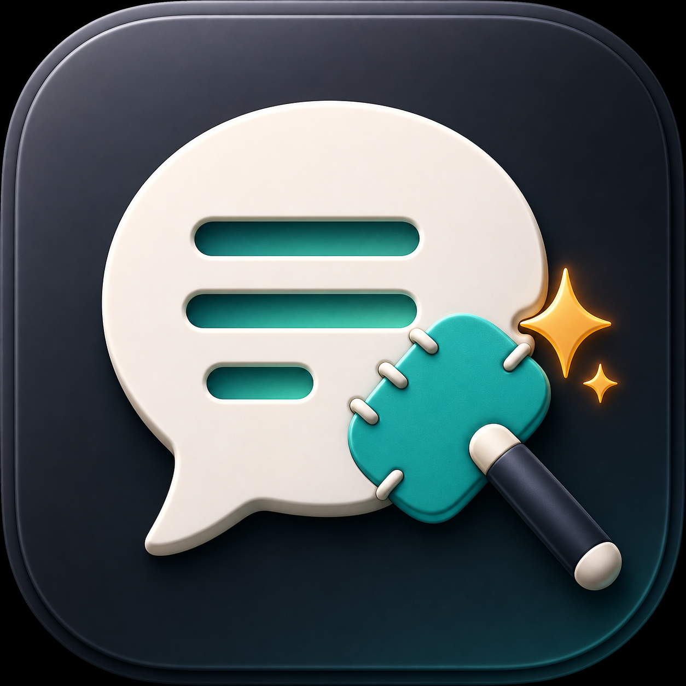

# SpeakPatch

<p align="center">
  
</p>

SpeakPatch is a lightweight macOS menu-bar assistant for improving selected text. Select text in any app, use the quick toolbar or press `Command + Shift + E`, and fix grammar through any OpenAI-compatible chat completions endpoint.

## Features

- Native SwiftUI macOS menu-bar app
- PopClip-style toolbar after selecting text
- Global shortcut: `Command + Shift + E`
- Grammar correction as the default action
- OpenAI-compatible provider settings
- Editable system prompt with presets
- Actions for grammar, natural phrasing, concise wording, translation, and explanations
- One-click copy and replace-input flow

## Install

```bash
brew tap taotao7/tap
brew install --cask speakpatch
open /Applications/SpeakPatch.app
```

On first launch, grant Accessibility permission when macOS prompts:

```txt
System Settings > Privacy & Security > Accessibility > SpeakPatch
```

SpeakPatch needs Accessibility access to detect selected text and to support the shortcut fallback that reads the current selection.

If macOS keeps showing the permission dialog after you already enabled SpeakPatch, reset the stale permission entry and grant it again:

```bash
tccutil reset Accessibility com.speakpatch.app
open /Applications/SpeakPatch.app
```

Then use the menu-bar item and choose `Grant Accessibility Permission`. Click `Open System Settings`, enable `SpeakPatch`, quit SpeakPatch, and reopen it.

## Provider Setup

Open the menu-bar item, choose `Settings`, then configure an OpenAI-compatible provider.

OpenAI example:

```txt
Base URL: https://api.openai.com
API Key: sk-...
Model: gpt-4o-mini
Path: /v1/chat/completions
```

DeepSeek example:

```txt
Base URL: https://api.deepseek.com
API Key: ...
Model: deepseek-chat
Path: /v1/chat/completions
```

The app stores settings in macOS user defaults. API requests are sent directly from the app to the configured provider.

## Build From Source

```bash
swift build -c release
./scripts/build-app.sh release
open SpeakPatch.app
```

For development, you can also open the Swift package in Xcode:

```bash
open Package.swift
```

## Release

Tagged releases are built by GitHub Actions.

```bash
git tag v0.1.2
git push origin v0.1.2
```

The release workflow builds `SpeakPatch.app`, uploads `SpeakPatch-<version>-macos.zip`, and updates `taotao7/homebrew-tap` with the cask checksum. The repository must have a `TAP_GITHUB_TOKEN` secret with permission to push to the tap.
